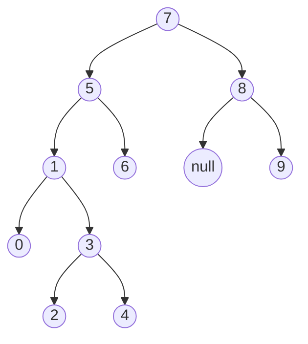

# Binary Search Tree Project

Click [here](https://app.patika.dev/courses/veri-yapilari-ve-algoritmalar/binary-search-tree-proje) to see project page.

> In computer science, binary search, also known as half-interval search, logarithmic search, or binary chop, is a search algorithm that finds the position of a target value within a sorted array. Binary search compares the target value to the middle element of the array. If they are not equal, the half in which the target cannot lie is eliminated and the search continues on the remaining half, again taking the middle element to compare to the target value, and repeating this until the target value is found. If the search ends with the remaining half being empty, the target is not in the array. 

(Source: [Wikipedia](https://en.wikipedia.org/wiki/Binary_search_algorithm))

Requested: Write *binary search tree algorithm* for **[7, 5, 1, 8, 3, 6, 0, 9, 4, 2]** array.

Given array: **[7, 5, 1, 8, 3, 6, 0, 9, 4, 2]**
The algorithm we'll use: **binary search tree**

A **root** is the first element of an array. So the root value of the given array is **7**. We'll write that value at the top most.

Other steps are below:

 1. 5 is less than 7. Place it to the left.
 2. 1 is less than 7 and less than 5 also. Place it to the left of 5.
 3. 8 is greater than 7. So place it to the right.
 4. 3 is less than 7 and 5. But greater than 1. Place it to the right side of 1.
 5. 6 is less than 7 but greater than 5. Place it to the right side of 5.
 6. 0 is less than 7, 5 and 1. Place it to the left side of 1.
 7. 9 is greater than 7 and 8. Place it to the right side of 8.
 8. 4 is less than 7 and 5, greater than 1 and 3. Place it as proper leaf node.
 9. 2 is less than 7 and 5, greater than 1 but less than 3. Place it as proper leaf node.

## Flow chart

Big-O notation: **O(log n)**
